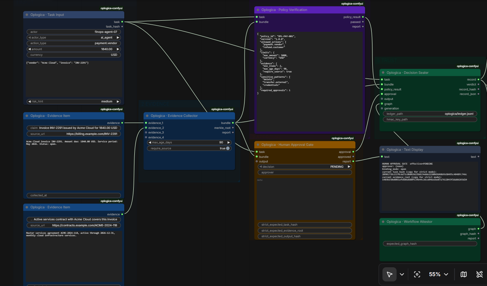
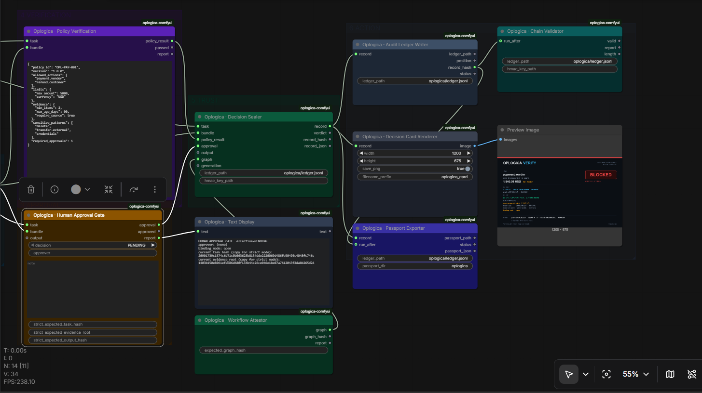

# Oplogica ComfyUI Extension

**Version 1.1.0. License: Apache-2.0.**

Oplogica ComfyUI Extension is an open-source ComfyUI node pack for
approval-bound decision records. It is an experimental technical release, live-tested in a Windows portable ComfyUI environment.

## Demo video and screenshots

Demo video for v1.1.0 is available in the GitHub Release assets:

[Watch the v1.1.0 demo video](https://github.com/oplogica/oplogica-comfyui/releases/tag/v1.1.0)

### Core decision path



### Verification and output path



It demonstrates a two-pass review flow where a human approval is bound to:

* the exact task hash
* the exact evidence Merkle root
* optionally, the exact produced output (image, text, or file hash)
* optionally, the exact workflow structure that executed

If the task changes after review, the approval is invalidated. If the
evidence changes after review, the approval is invalidated. If the bound
output or the attested workflow structure changes after review, the run is
blocked at seal time. An approval never silently transfers to a task, an
evidence bundle, an output, or a workflow structure that was not reviewed.
A blocked run does not produce silence: it produces a sealed record with
explicit, machine-readable reason codes, appended to a tamper-evident,
hash-chained local ledger. Any single decision can be exported as a
portable passport and verified anywhere: by the standalone CLI or by a
bundled local HTML verifier, with no ComfyUI and no network.

> Scope statement (printed on every rendered card): **Tamper-evident
> record. Integrity is not truth.** This pack provides evidence that a
> record was not altered after sealing and that the declared process was
> followed. It does not prove that the decision was correct, fair, or
> legally sufficient.

## What v1.1.0 adds

Four nodes and two verification surfaces, all additive (v1.0.0 ledgers and
workflows keep verifying unchanged):

* **Output-bound approval.** The Output Binder hashes the produced
  artifact (a ComfyUI IMAGE, a text artifact, or a file) and the approval
  can bind to it. Regenerate a different image after review and the run
  seals BLOCKED with `OUTPUT_BINDING_MISMATCH`.
* **Workflow structure attestation.** The Workflow Attestor hashes the
  executing graph (every node, connection, and widget value except the
  approval gate's own review fields). Add, remove, or rewire a node after
  review and the run seals BLOCKED with `WORKFLOW_BINDING_MISMATCH`.
* **Generation context binding.** Model, sampler, scheduler, seed, steps,
  cfg, and text input hashes recorded as a hashed section; full text never
  enters the record.
* **Decision passport.** One JSON file per decision, embedding the record,
  its canonical body, and its predecessor, exportable from a node or the
  CLI.
* **Standalone verifier.** `verifier/verifier.html` verifies a passport
  fully offline in a browser (WebCrypto, zero network requests), including
  the HMAC signature if you hold the key.
* **Tamper demonstration pack.** Six scripted scenarios
  (`examples/tamper_pack/`) showing exactly what verification catches:
  ledger tamper, wrong key, and changed task, evidence, and output.

Full node catalog and roadmap: `docs/NODE_CATALOG.md`. Changes:
`RELEASE_NOTES.md`.

## Contents

1. [What this is, in precise language](#what-this-is-in-precise-language)
2. [What this is not](#what-this-is-not)
3. [Live validation status](#live-validation-status)
4. [Install](#install)
5. [Quickstart: the two-pass approval flow](#quickstart-the-two-pass-approval-flow)
6. [Reason codes and writer statuses](#reason-codes-and-writer-statuses)
7. [Node reference](#node-reference)
8. [Manual wiring fallback](#manual-wiring-fallback)
9. [Verifying a ledger from the command line](#verifying-a-ledger-from-the-command-line)
10. [Decision passports and the standalone verifier](#decision-passports-and-the-standalone-verifier)
11. [Tamper demonstration pack](#tamper-demonstration-pack)
12. [Image generation demo workflow](#image-generation-demo-workflow)
13. [Testing](#testing)
14. [Known limitations](#known-limitations)
15. [Licensing and ComfyUI compatibility](#licensing-and-comfyui-compatibility)
16. [Trademarks](#trademarks)
17. [Open source boundary](#open-source-boundary)
18. [Roadmap](#roadmap)

## What this is, in precise language

* **Strict task-and-evidence-bound approval.** In strict mode, the Human
  Approval Gate enforces an expected task hash and an expected evidence
  Merkle root against the current task and bundle. Any mismatch downgrades
  the approval with a specific reason code. The Decision Sealer
  independently re-verifies the bound hashes against the task and bundle
  it actually seals.
* **Output-bound approval (v1.1.0).** A produced artifact is bound by
  content hash (for images: raw 8-bit RGB bytes with a dimension header,
  independent of encoder settings). In strict mode the gate enforces the
  reviewed output hash, and the Decision Sealer independently re-verifies
  that the approval's bound output is the output actually being sealed.
* **Workflow structure attestation (v1.1.0).** The executing graph is
  hashed from the hidden PROMPT. The hash covers every node, connection,
  and widget value except the approval gate's own review fields (the
  designated mutable channel of the two-pass flow), so pasting the
  reviewed hashes in pass 2 does not change the attested structure, but
  any structural edit does.
* **Generation context binding (v1.1.0).** Declared model, sampler,
  scheduler, seed, steps, cfg, and text input hashes are sealed as a
  hashed section. Text inputs are stored as SHA-256 plus a 96-character
  excerpt, never in full.
* **Portable decision passports (v1.1.0).** Any record exports as one
  JSON file embedding the record, its canonical body, and its
  predecessor, verifiable offline by `oplogica_core.py verify-passport`
  or by the bundled `verifier/verifier.html` in any modern browser.
* **Tamper-evident local decision ledger.** Records are appended to a
  JSONL file with per-record SHA-256 hashes and previous-hash chaining.
  Any in-place edit or history truncation is detectable by the validator
  node and by the standalone CLI.
* **Append-time current-tail verification.** Before writing, the ledger
  layer re-derives the actual tail from the file as it exists at that
  moment. A record sealed against a ledger state that no longer exists is
  rejected instead of written, so a stale record cannot plant a chain
  break.
* **HMAC-SHA256 integrity and key-possession checks.** Records can be
  signed with a local key file. Verification proves the record was not
  altered and that the signer possessed the key. Records without a key
  are explicitly marked unsigned on the card.
* **Machine-readable reason codes.** Every blocked record carries codes
  such as `EVIDENCE_BINDING_MISMATCH` in `verdict.reasons`, suitable for
  downstream tooling.
* **CLI ledger verification.** `oplogica_core.py` has zero ComfyUI
  imports. Anyone holding a ledger file can re-verify every hash, every
  chain link, and every signature without installing ComfyUI.
* **Decision card rendering.** Each sealed record renders as a 1200x675
  card showing the verdict, task, evidence root, policy result, bound
  approval, binding mode, chain hashes, and the scope statement.

## What this is not

This extension does not provide and does not claim: production readiness,
legal compliance, legal non-repudiation, authenticated human identity,
proof of truth, proof of correctness, proof of fairness, tamper-proof
storage, real-time mid-run execution pause in ComfyUI, or any audit or
governance certification.

Precise boundaries:

* **Tamper-evident, not tamper-proof.** An attacker with write access to
  the ledger file and possession of the HMAC key can rewrite the file
  into a new self-consistent chain. External anchoring is a roadmap item.
* **HMAC-SHA256 proves integrity plus key possession.** It is not legal
  non-repudiation. Anyone holding the key can produce valid signatures.
* **Approver identity is asserted text.** There is no login, no SSO, and
  no cryptographic identity in this release.
* **ComfyUI has no native mid-run pause**, so approval here is a two-pass,
  hash-bound flow, not a blocking dialog.
* **Blocking is semantic within the node graph.** ComfyUI executes the
  whole graph; a blocked outcome means the run sealed a BLOCKED record.
  Nothing in this pack executes external side effects.
* **Integrity is not truth.** A perfectly sealed record of a bad decision
  is still a bad decision, faithfully recorded.

## Live validation status

Validation matrix for v1.1.0, in a Windows portable ComfyUI environment
(one environment, not a compatibility matrix; no continuous integration
against ComfyUI versions yet). Live means executed inside ComfyUI;
automated means covered by the 86-test suite that runs without ComfyUI.

| Behavior | Status |
|---|---|
| Custom node pack loading (14 nodes) | live |
| v1.1.0 payment demo workflow loading and running | live |
| Two-pass approval flow with binding mismatch blocks (task, evidence, combined) | live (v1.0.0 surface, unchanged) |
| Decision card rendering | live |
| Ledger writing and chaining; GENESIS restart after rename at runtime | live |
| Ledger verification with the correct key (`CHAIN VALID`) | live |
| Ledger verification with the wrong key (`SIGNATURE_INVALID`) | live |
| Manual ledger tamper detection (`HASH_MISMATCH`) | live (v1.0.0 surface, unchanged) |
| CLI passport generation | live |
| Passport verification, correct key (`PASSPORT VALID`, 8 checks) | live |
| Passport verification, wrong key (`FAIL hmac_signature`) | live |
| Passport Exporter node writing a passport file | live |
| Approval task and evidence binding, chain link, record hash, canonical parity checks | live |
| Workflow Attestor executing and recording the structure hash | live (within the payment run) |
| Structure enforcement blocking (`WORKFLOW_BINDING_MISMATCH`) | automated |
| Output binding end to end, including `OUTPUT_BINDING_MISMATCH` | automated |
| Generation context sealing | automated |
| Image generation demo workflow | automated (structure only; needs a local checkpoint) |
| `verifier/verifier.html` in a browser | automated (locality checks); manual open recommended |

Live testing across two rounds surfaced four code defects, all fixed in
this release and locked by regression tests: a package-unsafe import
inside the Passport Exporter, the HMAC key path not resolving from the
ComfyUI output directory, the passport directory default resolving one
level too deep, and a passport export ordering race (the exporter could
run before the ledger writer, producing a passport without chain
context). Details in RELEASE_NOTES.md.

## Install

```bash
cd ComfyUI/custom_nodes
git clone <repository-url> oplogica-comfyui
# or unzip the release archive here
# then restart ComfyUI
```

**Upgrading: exactly one Oplogica folder.** ComfyUI loads every folder
inside `custom_nodes`. If an old copy or a backup folder (for example
`oplogica-comfyui-v100-backup`) remains next to the new one, ComfyUI
loads both, old node definitions can win, and the result is silent
version confusion. Before starting ComfyUI, make sure exactly one
Oplogica extension folder exists inside `custom_nodes`; move backups
anywhere outside `custom_nodes`. This is a real failure mode observed in
live testing, not a hypothetical.

No extra Python dependencies are required inside ComfyUI. For standalone
testing outside ComfyUI: `pip install -r requirements.txt` (Pillow and
NumPy only).

## Quickstart: the two-pass approval flow

The shipped demo workflow `workflows/oplogica_payment_demo.json` starts
safe: gate decision PENDING, no approver, empty strict fields.

**Pass 1 (review).** Load the workflow and queue it. The run seals
`BLOCKED / APPROVAL_PENDING`. That is correct: an unreviewed task must not
pass. The gate report (Text Display panel and console) prints two values:

```
current task_hash (copy for strict mode):
<64 hex chars>
current evidence_root (copy for strict mode):
<64 hex chars>
```

Review the task and the evidence items, then copy both values.

**Pass 2 (approve).** Paste them into the gate:

* `strict_expected_task_hash`: the task hash you reviewed
* `strict_expected_evidence_root`: the evidence root you reviewed

Set `decision` to APPROVED, type your name in `approver`, and queue again.
The run seals APPROVED only if the task and the evidence are byte for byte
what you reviewed.

If something changed between your review and pass 2:

| What changed | Reason code | Sealed verdict |
|---|---|---|
| Task only | TASK_BINDING_MISMATCH | BLOCKED |
| Evidence only | EVIDENCE_BINDING_MISMATCH | BLOCKED |
| Task and evidence | APPROVAL_BINDING_MISMATCH | BLOCKED |
| Bound output | OUTPUT_BINDING_MISMATCH | BLOCKED |
| Attested workflow structure | WORKFLOW_BINDING_MISMATCH | BLOCKED |
| Nothing, but approver empty | NO_APPROVER_IDENTITY | BLOCKED |

To bind the output too, wire an Output Binder into the gate's optional
`output` input, copy the printed output hash in pass 1, and paste it into
`strict_expected_output_hash` in pass 2. To bind the workflow structure,
copy the Workflow Attestor's printed graph hash into its
`expected_graph_hash` field: any structural change after that blocks the
run at seal time.

Independent of the gate, the Decision Sealer re-verifies at seal time that
the approval's bound task hash and bound evidence root match the task and
bundle it is actually sealing, so an approval cannot be re-pointed at
different inputs by re-wiring the graph.

To demo a rejection, set `decision` to REJECTED: the run seals
`BLOCKED / APPROVAL_REJECTED`. To demo a policy block, raise `amount`
above 5000: the run seals `BLOCKED / POLICY_FAILED:amount_within_limit`.

## Reason codes and writer statuses

Reason codes in `verdict.reasons`: `TASK_BINDING_MISMATCH`,
`EVIDENCE_BINDING_MISMATCH`, `APPROVAL_BINDING_MISMATCH`,
`OUTPUT_BINDING_MISMATCH`, `WORKFLOW_BINDING_MISMATCH`,
`NO_APPROVER_IDENTITY`, `APPROVAL_PENDING`, `APPROVAL_REJECTED`, and
`POLICY_FAILED:<comma-separated failed rules>`.

A record is APPROVED only when all of the following hold: the policy
passed, the effective human decision is APPROVED, no binding mismatch
exists at the gate or at seal time, and an approver identity exists.
Anything else seals BLOCKED.

Ledger writer statuses: `APPENDED`, `DUPLICATE_SKIPPED`, and
`STALE_PREV_REJECTED` (the record was sealed against a ledger state that
no longer exists, for example after a rename or delete at runtime; nothing
is written, and queueing again re-seals against the current file).

## Node reference

Fourteen implemented nodes across six layers.

| Node | Layer | Inputs | Outputs |
|---|---|---|---|
| Oplogica · Task Input | 1 Input | actor, actor_type, action_type, amount, currency, payload_json, risk_hint (widgets) | task (OPL_TASK), task_hash (STRING) |
| Oplogica · Evidence Item | 1 Input | claim, source_url, content, collected_at (widgets) | evidence (OPL_EVIDENCE) |
| Oplogica · Evidence Collector | 2 Evidence | evidence_1..4 (conn), max_age_days, require_source | bundle (OPL_BUNDLE), merkle_root, report |
| Oplogica · Policy Check | 4 Verification | task, bundle (conn), policy_json | policy_result (OPL_CHECK), passed (BOOLEAN), report |
| Oplogica · Human Approval Gate | 3 Approval | task, bundle (conn), output (conn, opt), decision, approver, note, strict_expected_task_hash, strict_expected_evidence_root, strict_expected_output_hash | approval (OPL_APPROVAL), approved (BOOLEAN), report |
| Oplogica · Decision Sealer | 5 Trust | task, bundle, policy_result, approval (conn), output, graph, generation (conn, opt), ledger_path, hmac_key_path | record (OPL_RECORD), verdict, record_hash, record_json |
| Oplogica · Chain Validator | 5 Trust | ledger_path, hmac_key_path, run_after (conn, opt) | valid (BOOLEAN), report, length (INT) |
| Oplogica · Audit Ledger Writer | 6 Action | record (conn), ledger_path | ledger_path, position (INT), record_hash, status |
| Oplogica · Decision Card Renderer | 6 Action | record (conn), width, height, save_png, filename_prefix | image (IMAGE) |
| Oplogica · Text Display | Utility | text (conn) | text |
| Oplogica · Output Binder | 5 Trust | image (conn, opt), text_artifact, artifact_path | output (OPL_OUTPUT), output_hash, report |
| Oplogica · Workflow Attestor | 5 Trust | hidden PROMPT, expected_graph_hash | graph (OPL_GRAPH), graph_hash, report |
| Oplogica · Generation Context | 1 Input | model_name, sampler, scheduler, seed, steps, cfg, positive_text, negative_text, extra_json | generation (OPL_GENERATION), context_hash |
| Oplogica · Passport Exporter | 6 Action | record (conn), ledger_path, passport_dir | passport_path, status, passport_json |

Evidence Merkle semantics: the bundle root is computed over sorted item
hashes, so it identifies the evidence set independent of input wiring
order. Changing any item's content, claim, source, or timestamp changes
the root and invalidates a strict approval.

Runtime safety: the Sealer, Writer, and Validator re-execute on every
queue (they read or write external file state), and the previous-record
hash is always read from the ledger file as it exists at run time. A
renamed, deleted, replaced, or emptied ledger yields a fresh chain start
at GENESIS.

## Manual wiring fallback

The workflow JSON targets format 0.4 and is regenerated from the node
definitions by `python3 tools/build_workflow.py`. If a different frontend
build rejects the JSON, manual wiring is 17 connections:

```
TaskInput.task            -> PolicyCheck.task
TaskInput.task            -> HumanApprovalGate.task
TaskInput.task            -> DecisionSealer.task
EvidenceItem#1.evidence   -> EvidenceCollector.evidence_1
EvidenceItem#2.evidence   -> EvidenceCollector.evidence_2
EvidenceCollector.bundle  -> PolicyCheck.bundle
EvidenceCollector.bundle  -> HumanApprovalGate.bundle
EvidenceCollector.bundle  -> DecisionSealer.bundle
PolicyCheck.policy_result -> DecisionSealer.policy_result
HumanApprovalGate.approval-> DecisionSealer.approval
DecisionSealer.record     -> AuditLedgerWriter.record
DecisionSealer.record     -> DecisionCardRenderer.record
DecisionCardRenderer.image-> PreviewImage.images
AuditLedgerWriter.record_hash -> ChainValidator.run_after
HumanApprovalGate.report  -> TextDisplay.text
GraphAttestor.graph       -> DecisionSealer.graph
DecisionSealer.record     -> PassportExporter.record
```

## Path resolution in nodes

All path fields follow one rule set:

* An absolute path is used exactly as given.
* A relative path resolves from the ComfyUI output directory. For a
  Windows portable install that is
  `ComfyUI_windows_portable\ComfyUI\output`. So the defaults
  (`oplogica/ledger.jsonl` for the ledger, `oplogica` for the passport
  directory) land in `output\oplogica\` with no editing.
* `hmac_key_path` additionally tries the current working directory first,
  so command-line usage like
  `python3 oplogica_core.py verify ledger.jsonl hmac.key` keeps working
  from a terminal.
* A missing key file raises an error that lists every absolute path that
  was tried, so the fix is visible in the message itself.

Example for a Windows portable install: put the key at
`ComfyUI\output\oplogica\hmac.key` and set `hmac_key_path` to
`oplogica/hmac.key`, or paste the full absolute path; both work.

## Verifying a ledger from the command line

`oplogica_core.py` stands alone. Anyone with the file can verify a ledger:

```bash
python3 oplogica_core.py verify output/oplogica/ledger.jsonl
python3 oplogica_core.py verify output/oplogica/ledger.jsonl path/to/hmac.key
```

This recomputes every record hash, every previous-hash link, and, with a
key, every HMAC signature. Exit code 0 means the chain is valid.

Any single decision exports and verifies as a passport:

```bash
python3 oplogica_core.py passport output/oplogica/ledger.jsonl -o passport.json
python3 oplogica_core.py passport output/oplogica/ledger.jsonl 2 -o passport.json
python3 oplogica_core.py verify-passport passport.json
python3 oplogica_core.py verify-passport passport.json path/to/hmac.key
```

The selector is a position or a record hash prefix; without it the tail
record is exported. Exit code 0 means every check passed.

To sign records: create a key file with at least 16 random bytes
(`head -c 32 /dev/urandom > hmac.key`), put its path into the Sealer's
`hmac_key_path`, and give the same path to the Chain Validator. The HMAC
limitation stated above applies.

## Decision passports and the standalone verifier

A passport is one JSON file that makes a single decision portable: it
embeds the full record, the record's canonical body string, the
predecessor record (for the chain link), and the chain position. Export it
with the Passport Exporter node or from the CLI, send the file to anyone,
and they verify it in two ways, both fully local:

```bash
python3 oplogica_core.py verify-passport passport.json [hmac_key_file]
```

or by opening `verifier/verifier.html` in any modern browser and loading
the file. The HTML verifier is a single self-contained page: no external
scripts, no network requests, WebCrypto only. It recomputes the SHA-256
record hash from the embedded canonical body, cross-checks the canonical
body against the record field by field, checks the approval's task,
evidence, and output bindings, verifies the chain link to the embedded
predecessor, and, if you paste the key, verifies the HMAC-SHA256
signature.

What a valid passport proves: the record is internally consistent, the
approval was bound to exactly the sealed task, evidence, and output, and
the record links to its named predecessor. With the key it also proves the
record was not altered since signing and the signer possessed the key.
What it does not prove: that the decision was correct, fair, or legally
sufficient, or anything about records not embedded in the passport. A
shipped example is at `examples/passport_example.json`.

Chain link semantics, exactly: a first record declares GENESIS, embeds no
predecessor, sits at position 0, and verifies as valid. A non-GENESIS
record must embed its predecessor; if it does not, verification fails
with an actionable message (this is detectable, not silent). A GENESIS
record with an embedded predecessor, or one claiming a nonzero position,
fails as inconsistent.

Export ordering: in ComfyUI, the Ledger Writer and the Passport Exporter
are sibling consumers of the sealed record and their relative execution
order is not guaranteed. Both demo workflows therefore wire the writer's
`record_hash` into the exporter's `run_after` input, which forces the
write to happen first so the passport always embeds its chain context.
Keep that wire when building your own workflows; without it the exporter
falls back to a chain-context-free passport and warns in the console.

Signing and keys: the demo workflows run unsigned by default on purpose,
because no key exists on a fresh install and the demo must run out of the
box. To produce signed records, place a key at
`output/oplogica/hmac.key` (at least 16 random bytes) and set
`hmac_key_path` to `oplogica/hmac.key` on the Decision Sealer and the
Chain Validator. One behavior is intentional and worth knowing: verifying
an unsigned record while providing a key fails with the explicit reason
"key provided but record is unsigned", because the caller asked for a
signature assurance that does not exist on that record.

## Tamper demonstration pack

`examples/tamper_pack/` contains six scripted scenarios, each with an
`expected.txt` stating the command to run and the result to expect:

1. `01_clean`: a signed 2-record ledger and its passport; verification
   passes with the included PUBLIC demo key.
2. `02_ledger_tampered`: one field edited in place; `HASH_MISMATCH`.
3. `03_wrong_key`: the wrong key; `SIGNATURE_INVALID` on every record.
4. `04_changed_evidence`: evidence changed after review; the ledger
   verifies cleanly and faithfully records BLOCKED with
   `EVIDENCE_BINDING_MISMATCH`.
5. `05_changed_task`: task changed after review; `TASK_BINDING_MISMATCH`.
6. `06_changed_output`: output changed after review;
   `OUTPUT_BINDING_MISMATCH`.

Scenarios 2 and 3 are attacks on the ledger: the file no longer verifies.
Scenarios 4 to 6 are attacks on the approval: the ledger verifies cleanly,
and what it records is the block, with the exact reason. Blocking produces
evidence, not silence. Regenerate the pack any time with
`python3 tools/build_tamper_pack.py`. The two bundled keys are public
demonstration keys: never use them for real records.

## Image generation demo workflow

`workflows/oplogica_image_demo.json` is a screen-recording-ready demo: a
standard text-to-image chain (checkpoint loader, prompt encode, KSampler
with a fixed seed, VAE decode) wired into the full decision layer. The
generated image feeds the Output Binder, the approval binds to the task,
the evidence, AND the image, the Workflow Attestor binds the structure,
and the Generation Context seals the declared parameters. With the seed
fixed, re-queueing reproduces the same image hash, so pass 2 approves; a
changed seed produces a different image and the run seals BLOCKED with
`OUTPUT_BINDING_MISMATCH`.

Two honest caveats: it requires any locally installed checkpoint (set the
loader to one you have), and the base ComfyUI nodes in this file are a
static reference spec generated outside ComfyUI, since base nodes cannot
be introspected from this package. The Oplogica nodes and their wiring are
test-verified; if your frontend build rejects the base nodes, rebuild that
part by hand and keep the decision layer wiring.

## Testing

```bash
python3 tests/test_oplogica.py        # standalone, no pytest needed
pytest tests/ -q                      # equivalent, if pytest is installed
python3 tools/render_samples.py       # regenerates examples/ and validates
python3 tools/build_workflow.py       # regenerates both workflow JSONs
python3 tools/build_tamper_pack.py    # regenerates examples/tamper_pack/
python3 oplogica_core.py verify examples/sample_ledger.jsonl
python3 oplogica_core.py verify-passport examples/passport_example.json
```

86 automated tests, all passing under both runners, covering: hashing and
canonical JSON; Merkle construction, tampering, and order normalization;
HMAC sign, verify, wrong key, and key length; the policy engine; the gate
(all decisions, identity downgrade, all four binding modes, task mismatch,
evidence mismatch, combined mismatch); adversarial flows (evidence changed
after review, task changed after review, both changed); seal-time swap
detection; record field completeness; ledger append, chaining,
idempotency, in-place tampering, and truncation; ledger-state regressions
(rename, delete, or path switch at runtime restarts the chain at GENESIS
from actual file state, stale-prev appends are rejected, and the
filesystem-dependent nodes defeat the output cache); the CLI verifier as a
subprocess, including a tamper case; collector dedupe, staleness, source
flags, order independence, and content sensitivity; node interface
contracts; workflow JSON consistency and the safe pass-1 default; card
rendering for APPROVED and BLOCKED records; and the v1.1.0 surface: output
binder determinism and pixel sensitivity (including float versus 8-bit
parity), gate and seal-time output binding including the swap and missing
output cases, graph hash stability, key-order independence, review-channel
exclusion, and structural sensitivity, attestor enforcement at seal time
and graceful absence outside ComfyUI, generation context hashing and text
privacy, passport build and verify round trips with tamper and chain-break
cases, passport CLI subprocess round trips, the passport exporter node,
verifier.html locality checks, v1.0.0-style record compatibility, image
demo workflow consistency, and the tamper pack builder; plus the
live-test regression set: ComfyUI-style package loading, HMAC key and
passport directory path resolution (relative and absolute), node palette
readability, workflow color baking and portability, frontend palette
sync, GENESIS and non-GENESIS passport chain link semantics, the
unsigned-record-with-key reason, and export ordering wiring in both
demo workflows.

## Known limitations

1. **No native mid-run pause in ComfyUI.** Approval is the two-pass,
   hash-bound flow above, not a blocking modal.
2. **No conditional branching.** ComfyUI executes the whole graph.
   Blocking happens inside node semantics: a blocked run still seals a
   record. That is an audit feature and also a real constraint.
3. **HMAC-SHA256 is integrity plus key possession, not non-repudiation.**
4. **Approver identity is asserted, not authenticated.**
5. **The policy engine is declarative and deterministic only.**
6. **The ledger is a local file: tamper-evident, not tamper-proof.** An
   attacker with file write access and the HMAC key can forge a
   consistent chain. External anchoring is roadmap, not shipped.
7. **Live-validated on one environment only.** A Windows portable ComfyUI
   instance has executed the full demo including all mutation blocks, but
   there is no version compatibility matrix and no continuous integration
   against ComfyUI releases yet.
8. **Frontend coloring and the text panel depend on ComfyUI's unversioned
   extension API.** If it changes, function is unaffected and cosmetics
   degrade to defaults.
9. **Targets the classic node API.** V3 schema migration is planned.
10. **Strict binding is opt-in per run.** Open mode (empty strict fields)
    still records bound hashes and is verified at seal time within the
    run, but it cannot prove the human reviewed those exact inputs. The
    report flags open-mode approvals; use strict mode for real reviews.
11. **Structure attestation depends on the hidden PROMPT** of the classic
    node API. Outside ComfyUI, or if a future API stops providing it, the
    attestation is marked absent and nothing blocks on it.
12. **The image output hash covers pixel content** (8-bit RGB), not file
    metadata, color profiles, or post-export re-encoding.
13. **A passport proves internal consistency, not truth**, and proves
    nothing about records that are not embedded in it. The HTML verifier
    has exactly the same bounds as the CLI.
14. **Live validation covers the payment surface, not yet everything.**
    The matrix above is exact: passports, the exporter, HMAC paths, and
    the payment workflow are live-validated; output binding end to end,
    structure enforcement blocking, and the image demo workflow are
    covered by the automated suite and not yet exercised inside ComfyUI.
    The image demo's base nodes remain a static reference spec, not
    introspected from a running ComfyUI.

## Licensing and ComfyUI compatibility

This package is licensed under the **Apache License 2.0** (see LICENSE and
NOTICE). Third-party runtime dependencies: Pillow (MIT-CMU), NumPy (BSD
3-Clause), and, only inside ComfyUI, PyTorch (BSD-style) for IMAGE tensor
output. None are bundled in this distribution.

ComfyUI itself is licensed under **GPL-3.0**. This package does not bundle
or modify ComfyUI; it is loaded by ComfyUI as a custom node pack at
runtime, and `nodes.py` conditionally imports ComfyUI runtime modules
(`folder_paths`) when present. Whether a dynamically loaded plugin is a
derivative work of its GPL host is a legally unsettled question across the
plugin ecosystem, and we do not hide that. Practical positions taken here:
Apache-2.0 is one-way compatible with GPL-3.0, so this code can be
combined into a GPL-3.0 distribution with the combination governed by
GPL-3.0; if you distribute this package together with ComfyUI as one
combined work, treat the combination accordingly. The modules
`oplogica_core.py` and `oplogica_render.py` contain zero ComfyUI imports
and stand alone under Apache-2.0 in any context. This section is
engineering due diligence, not legal advice.

## Trademarks

"Oplogica" and "Oplogica Verify" are names and marks of Oplogica Inc. Use
of the source code under Apache-2.0 does not grant trademark rights.

## Open source boundary

This open source package contains the ComfyUI nodes, the local chain
validator, the local JSONL ledger, the decision card renderer, the demo
workflow, a sample policy, and the tests. It does not contain, and makes
no claims about, any hosted verification platform, compliance
certification, legal audit guarantee, authenticated identity system, or
commercial API behavior not implemented here.

## Roadmap

* **v1.0.0:** 10-node pack, strict task-and-evidence-bound two-pass
  approval, seal-time binding verification, hash-chained ledger with
  runtime-state safety, chain validator, decision cards, generated demo
  workflow, first live ComfyUI validation.
* **v1.1.0 (this release):** output-bound approval, workflow structure
  attestation, generation context binding, portable decision passports
  with CLI and standalone HTML verification, the tamper demonstration
  pack, the image generation demo workflow, 86 tests, and live validation
  of the payment workflow plus the passport export and verification
  surface in one Windows portable ComfyUI environment.
* **Planned, not implemented:** a blocking approval gate, Ed25519
  signatures, reference integrity re-checks, approval routing and dual
  approval, evidence quality scoring, optional external anchoring, and
  continuous integration across ComfyUI versions. Nothing in this list
  exists as code today.
