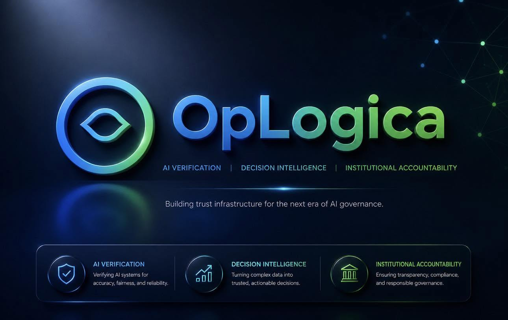

# Oplogica ComfyUI Extension

**Version 1.0.0 (initial public release). License: Apache-2.0.**

Oplogica ComfyUI Extension is an open-source ComfyUI node pack for
approval-bound decision records. It is an experimental technical release.

It demonstrates a two-pass review flow where a human approval is bound to:

* the exact task hash
* the exact evidence Merkle root

If the task changes after review, the approval is invalidated. If the
evidence changes after review, the approval is invalidated. If both change,
the approval is invalidated. An approval never silently transfers to a task
or an evidence bundle that was not reviewed. A blocked run does not produce
silence: it produces a sealed record with explicit, machine-readable reason
codes, appended to a tamper-evident, hash-chained local ledger that anyone
can verify from the command line.

> Scope statement (printed on every rendered card): **Tamper-evident
> record. Integrity is not truth.** This pack provides evidence that a
> record was not altered after sealing and that the declared process was
> followed. It does not prove that the decision was correct, fair, or
> legally sufficient.

Full node catalog and roadmap: `docs/NODE_CATALOG.md`. Changes:
`RELEASE_NOTES.md`.

## Contents

1. [What this is, in precise language](#what-this-is-in-precise-language)
2. [What this is not](#what-this-is-not)
3. [Live validation status](#live-validation-status)
4. [Install](#install)
5. [Quickstart: the two-pass approval flow](#quickstart-the-two-pass-approval-flow)
6. [Reason codes and writer statuses](#reason-codes-and-writer-statuses)
7. [Node reference](#node-reference)
8. [Manual wiring fallback](#manual-wiring-fallback)
9. [Verifying a ledger from the command line](#verifying-a-ledger-from-the-command-line)
10. [Testing](#testing)
11. [Known limitations](#known-limitations)
12. [Licensing and ComfyUI compatibility](#licensing-and-comfyui-compatibility)
13. [Trademarks](#trademarks)
14. [Open source boundary](#open-source-boundary)
15. [Roadmap](#roadmap)

## What this is, in precise language

* **Strict task-and-evidence-bound approval.** In strict mode, the Human
  Approval Gate enforces an expected task hash and an expected evidence
  Merkle root against the current task and bundle. Any mismatch downgrades
  the approval with a specific reason code. The Decision Sealer
  independently re-verifies the bound hashes against the task and bundle
  it actually seals.
* **Tamper-evident local decision ledger.** Records are appended to a
  JSONL file with per-record SHA-256 hashes and previous-hash chaining.
  Any in-place edit or history truncation is detectable by the validator
  node and by the standalone CLI.
* **Append-time current-tail verification.** Before writing, the ledger
  layer re-derives the actual tail from the file as it exists at that
  moment. A record sealed against a ledger state that no longer exists is
  rejected instead of written, so a stale record cannot plant a chain
  break.
* **HMAC-SHA256 integrity and key-possession checks.** Records can be
  signed with a local key file. Verification proves the record was not
  altered and that the signer possessed the key. Records without a key
  are explicitly marked unsigned on the card.
* **Machine-readable reason codes.** Every blocked record carries codes
  such as `EVIDENCE_BINDING_MISMATCH` in `verdict.reasons`, suitable for
  downstream tooling.
* **CLI ledger verification.** `oplogica_core.py` has zero ComfyUI
  imports. Anyone holding a ledger file can re-verify every hash, every
  chain link, and every signature without installing ComfyUI.
* **Decision card rendering.** Each sealed record renders as a 1200x675
  card showing the verdict, task, evidence root, policy result, bound
  approval, binding mode, chain hashes, and the scope statement.

## What this is not

This extension does not provide and does not claim: production readiness,
legal compliance, legal non-repudiation, authenticated human identity,
proof of truth, proof of correctness, proof of fairness, tamper-proof
storage, real-time mid-run execution pause in ComfyUI, or any audit or
governance certification.

Precise boundaries:

* **Tamper-evident, not tamper-proof.** An attacker with write access to
  the ledger file and possession of the HMAC key can rewrite the file
  into a new self-consistent chain. External anchoring is a roadmap item.
* **HMAC-SHA256 proves integrity plus key possession.** It is not legal
  non-repudiation. Anyone holding the key can produce valid signatures.
* **Approver identity is asserted text.** There is no login, no SSO, and
  no cryptographic identity in this release.
* **ComfyUI has no native mid-run pause**, so approval here is a two-pass,
  hash-bound flow, not a blocking dialog.
* **Blocking is semantic within the node graph.** ComfyUI executes the
  whole graph; a blocked outcome means the run sealed a BLOCKED record.
  Nothing in this pack executes external side effects.
* **Integrity is not truth.** A perfectly sealed record of a bad decision
  is still a bad decision, faithfully recorded.

## Live validation status

Version 1.0.0 carries the ledger-state safety fix validated from the
internal v0.2.1 build. It has been validated in a Windows portable ComfyUI
environment for the following behaviors:

* custom node pack loading
* demo workflow loading from `workflows/oplogica_payment_demo.json`
* the full two-pass approval flow, including binding mismatch blocks for
  task changes, evidence changes, and combined changes
* ledger file rename while ComfyUI remains running
* a new ledger starting from GENESIS after the rename
* continued ledger chaining across additional runs
* HMAC verification with the correct key
* HMAC rejection with the wrong key (`SIGNATURE_INVALID`)
* manual ledger tamper detection through `HASH_MISMATCH`

This is a first live behavior validation on one environment. There is no
compatibility matrix across ComfyUI versions and no continuous integration
against ComfyUI releases yet. All node logic is additionally covered by an
automated suite of 54 tests that run without ComfyUI.

## Install

```bash
cd ComfyUI/custom_nodes
git clone <repository-url> oplogica-comfyui
# or unzip the release archive here
# then restart ComfyUI
```

No extra Python dependencies are required inside ComfyUI. For standalone
testing outside ComfyUI: `pip install -r requirements.txt` (Pillow and
NumPy only).

## Quickstart: the two-pass approval flow

The shipped demo workflow `workflows/oplogica_payment_demo.json` starts
safe: gate decision PENDING, no approver, empty strict fields.

**Pass 1 (review).** Load the workflow and queue it. The run seals
`BLOCKED / APPROVAL_PENDING`. That is correct: an unreviewed task must not
pass. The gate report (Text Display panel and console) prints two values:

```
current task_hash (copy for strict mode):
<64 hex chars>
current evidence_root (copy for strict mode):
<64 hex chars>
```

Review the task and the evidence items, then copy both values.

**Pass 2 (approve).** Paste them into the gate:

* `strict_expected_task_hash`: the task hash you reviewed
* `strict_expected_evidence_root`: the evidence root you reviewed

Set `decision` to APPROVED, type your name in `approver`, and queue again.
The run seals APPROVED only if the task and the evidence are byte for byte
what you reviewed.

If something changed between your review and pass 2:

| What changed | Reason code | Sealed verdict |
|---|---|---|
| Task only | TASK_BINDING_MISMATCH | BLOCKED |
| Evidence only | EVIDENCE_BINDING_MISMATCH | BLOCKED |
| Task and evidence | APPROVAL_BINDING_MISMATCH | BLOCKED |
| Nothing, but approver empty | NO_APPROVER_IDENTITY | BLOCKED |

Independent of the gate, the Decision Sealer re-verifies at seal time that
the approval's bound task hash and bound evidence root match the task and
bundle it is actually sealing, so an approval cannot be re-pointed at
different inputs by re-wiring the graph.

To demo a rejection, set `decision` to REJECTED: the run seals
`BLOCKED / APPROVAL_REJECTED`. To demo a policy block, raise `amount`
above 5000: the run seals `BLOCKED / POLICY_FAILED:amount_within_limit`.

## Reason codes and writer statuses

Reason codes in `verdict.reasons`: `TASK_BINDING_MISMATCH`,
`EVIDENCE_BINDING_MISMATCH`, `APPROVAL_BINDING_MISMATCH`,
`NO_APPROVER_IDENTITY`, `APPROVAL_PENDING`, `APPROVAL_REJECTED`, and
`POLICY_FAILED:<comma-separated failed rules>`.

A record is APPROVED only when all of the following hold: the policy
passed, the effective human decision is APPROVED, no binding mismatch
exists at the gate or at seal time, and an approver identity exists.
Anything else seals BLOCKED.

Ledger writer statuses: `APPENDED`, `DUPLICATE_SKIPPED`, and
`STALE_PREV_REJECTED` (the record was sealed against a ledger state that
no longer exists, for example after a rename or delete at runtime; nothing
is written, and queueing again re-seals against the current file).

## Node reference

Ten implemented nodes across six layers.

| Node | Layer | Inputs | Outputs |
|---|---|---|---|
| Oplogica · Task Input | 1 Input | actor, actor_type, action_type, amount, currency, payload_json, risk_hint (widgets) | task (OPL_TASK), task_hash (STRING) |
| Oplogica · Evidence Item | 1 Input | claim, source_url, content, collected_at (widgets) | evidence (OPL_EVIDENCE) |
| Oplogica · Evidence Collector | 2 Evidence | evidence_1..4 (conn), max_age_days, require_source | bundle (OPL_BUNDLE), merkle_root, report |
| Oplogica · Policy Check | 4 Verification | task, bundle (conn), policy_json | policy_result (OPL_CHECK), passed (BOOLEAN), report |
| Oplogica · Human Approval Gate | 3 Approval | task, bundle (conn), decision, approver, note, strict_expected_task_hash, strict_expected_evidence_root | approval (OPL_APPROVAL), approved (BOOLEAN), report |
| Oplogica · Decision Sealer | 5 Trust | task, bundle, policy_result, approval (conn), ledger_path, hmac_key_path | record (OPL_RECORD), verdict, record_hash, record_json |
| Oplogica · Chain Validator | 5 Trust | ledger_path, hmac_key_path, run_after (conn, opt) | valid (BOOLEAN), report, length (INT) |
| Oplogica · Audit Ledger Writer | 6 Action | record (conn), ledger_path | ledger_path, position (INT), record_hash, status |
| Oplogica · Decision Card Renderer | 6 Action | record (conn), width, height, save_png, filename_prefix | image (IMAGE) |
| Oplogica · Text Display | Utility | text (conn) | text |

Evidence Merkle semantics: the bundle root is computed over sorted item
hashes, so it identifies the evidence set independent of input wiring
order. Changing any item's content, claim, source, or timestamp changes
the root and invalidates a strict approval.

Runtime safety: the Sealer, Writer, and Validator re-execute on every
queue (they read or write external file state), and the previous-record
hash is always read from the ledger file as it exists at run time. A
renamed, deleted, replaced, or emptied ledger yields a fresh chain start
at GENESIS.

## Manual wiring fallback

The workflow JSON targets format 0.4 and is regenerated from the node
definitions by `python3 tools/build_workflow.py`. If a different frontend
build rejects the JSON, manual wiring is 15 connections:

```
TaskInput.task            -> PolicyCheck.task
TaskInput.task            -> HumanApprovalGate.task
TaskInput.task            -> DecisionSealer.task
EvidenceItem#1.evidence   -> EvidenceCollector.evidence_1
EvidenceItem#2.evidence   -> EvidenceCollector.evidence_2
EvidenceCollector.bundle  -> PolicyCheck.bundle
EvidenceCollector.bundle  -> HumanApprovalGate.bundle
EvidenceCollector.bundle  -> DecisionSealer.bundle
PolicyCheck.policy_result -> DecisionSealer.policy_result
HumanApprovalGate.approval-> DecisionSealer.approval
DecisionSealer.record     -> AuditLedgerWriter.record
DecisionSealer.record     -> DecisionCardRenderer.record
DecisionCardRenderer.image-> PreviewImage.images
AuditLedgerWriter.record_hash -> ChainValidator.run_after
HumanApprovalGate.report  -> TextDisplay.text
```

## Verifying a ledger from the command line

`oplogica_core.py` stands alone. Anyone with the file can verify a ledger:

```bash
python3 oplogica_core.py verify output/oplogica/ledger.jsonl
python3 oplogica_core.py verify output/oplogica/ledger.jsonl path/to/hmac.key
```

This recomputes every record hash, every previous-hash link, and, with a
key, every HMAC signature. Exit code 0 means the chain is valid.

To sign records: create a key file with at least 16 random bytes
(`head -c 32 /dev/urandom > hmac.key`), put its path into the Sealer's
`hmac_key_path`, and give the same path to the Chain Validator. The HMAC
limitation stated above applies.

## Testing

```bash
python3 tests/test_oplogica.py        # standalone, no pytest needed
pytest tests/ -q                      # equivalent, if pytest is installed
python3 tools/render_samples.py       # regenerates examples/ and validates
python3 tools/build_workflow.py       # regenerates the workflow JSON
python3 oplogica_core.py verify examples/sample_ledger.jsonl
```

54 automated tests, all passing under both runners, covering: hashing and
canonical JSON; Merkle construction, tampering, and order normalization;
HMAC sign, verify, wrong key, and key length; the policy engine; the gate
(all decisions, identity downgrade, all four binding modes, task mismatch,
evidence mismatch, combined mismatch); adversarial flows (evidence changed
after review, task changed after review, both changed); seal-time swap
detection; record field completeness; ledger append, chaining,
idempotency, in-place tampering, and truncation; ledger-state regressions
(rename, delete, or path switch at runtime restarts the chain at GENESIS
from actual file state, stale-prev appends are rejected, and the
filesystem-dependent nodes defeat the output cache); the CLI verifier as a
subprocess, including a tamper case; collector dedupe, staleness, source
flags, order independence, and content sensitivity; node interface
contracts; workflow JSON consistency and the safe pass-1 default; and card
rendering for APPROVED and BLOCKED records.

## Known limitations

1. **No native mid-run pause in ComfyUI.** Approval is the two-pass,
   hash-bound flow above, not a blocking modal.
2. **No conditional branching.** ComfyUI executes the whole graph.
   Blocking happens inside node semantics: a blocked run still seals a
   record. That is an audit feature and also a real constraint.
3. **HMAC-SHA256 is integrity plus key possession, not non-repudiation.**
4. **Approver identity is asserted, not authenticated.**
5. **The policy engine is declarative and deterministic only.**
6. **The ledger is a local file: tamper-evident, not tamper-proof.** An
   attacker with file write access and the HMAC key can forge a
   consistent chain. External anchoring is roadmap, not shipped.
7. **Live-validated on one environment only.** A Windows portable ComfyUI
   instance has executed the full demo including all mutation blocks, but
   there is no version compatibility matrix and no continuous integration
   against ComfyUI releases yet.
8. **Frontend coloring and the text panel depend on ComfyUI's unversioned
   extension API.** If it changes, function is unaffected and cosmetics
   degrade to defaults.
9. **Targets the classic node API.** V3 schema migration is planned.
10. **Strict binding is opt-in per run.** Open mode (empty strict fields)
    still records bound hashes and is verified at seal time within the
    run, but it cannot prove the human reviewed those exact inputs. The
    report flags open-mode approvals; use strict mode for real reviews.

## Licensing and ComfyUI compatibility

This package is licensed under the **Apache License 2.0** (see LICENSE and
NOTICE). Third-party runtime dependencies: Pillow (MIT-CMU), NumPy (BSD
3-Clause), and, only inside ComfyUI, PyTorch (BSD-style) for IMAGE tensor
output. None are bundled in this distribution.

ComfyUI itself is licensed under **GPL-3.0**. This package does not bundle
or modify ComfyUI; it is loaded by ComfyUI as a custom node pack at
runtime, and `nodes.py` conditionally imports ComfyUI runtime modules
(`folder_paths`) when present. Whether a dynamically loaded plugin is a
derivative work of its GPL host is a legally unsettled question across the
plugin ecosystem, and we do not hide that. Practical positions taken here:
Apache-2.0 is one-way compatible with GPL-3.0, so this code can be
combined into a GPL-3.0 distribution with the combination governed by
GPL-3.0; if you distribute this package together with ComfyUI as one
combined work, treat the combination accordingly. The modules
`oplogica_core.py` and `oplogica_render.py` contain zero ComfyUI imports
and stand alone under Apache-2.0 in any context. This section is
engineering due diligence, not legal advice.

## Trademarks

"Oplogica" and "Oplogica Verify" are names and marks of Oplogica Inc. Use
of the source code under Apache-2.0 does not grant trademark rights.

## Open source boundary

This open source package contains the ComfyUI nodes, the local chain
validator, the local JSONL ledger, the decision card renderer, the demo
workflow, a sample policy, and the tests. It does not contain, and makes
no claims about, any hosted verification platform, compliance
certification, legal audit guarantee, authenticated identity system, or
commercial API behavior not implemented here.

## Roadmap

* **v1.0.0 (this release):** 10-node pack, strict task-and-evidence-bound
  two-pass approval, seal-time binding verification, hash-chained ledger
  with runtime-state safety, chain validator, decision cards, generated
  demo workflow, 54 tests, first live ComfyUI validation.
* **Planned, not implemented:** output-bound approval (generated image
  hash in the record), workflow graph attestation, generation context
  binding (model, sampler, seed, text input hashes), a portable decision
  passport export, a blocking approval gate, Ed25519 signatures,
  reference integrity re-checks, approval routing and dual approval,
  optional external anchoring, and continuous integration across ComfyUI
  versions. Nothing in this list exists as code today.
